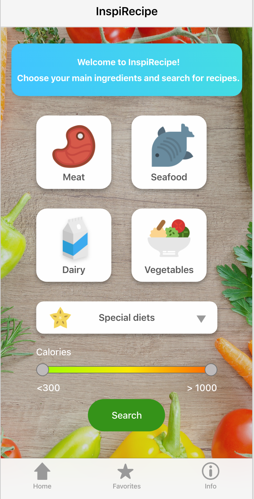

# AdobeXD-project

## InspiRecipe

Inspirecipe is designed to give inspiring recipes quickly for busy home chefs

**InspiRecipe provides**
- search with main ingredients, calories, and special diets
- saving recipes for later use

### How to use the prototype?

**Search**

1. Select a gategory (only meat works for now)
2. Select an ingredients (only chicken works for now)
3. Save your choice
4. Select a special diet (only gluten-free works for now)
5. Search

Now you will see recipes that match your search. Open recipe for detailed information.

**Favorites**

1. Click the star in the right corner of a recipe
2. Open favorites view from the tab bar below

**Prototype link**

https://xd.adobe.com/view/5e5752c0-f9d0-418d-4c0f-92c27dc46588-2866/?fullscreen&hints=off
